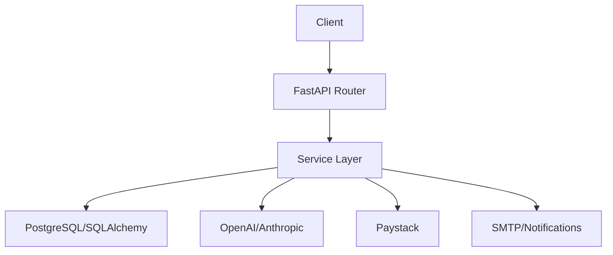

# Elite Coach AI Backend

Elite Coach AI is a cutting-edge Learning Management System (LMS) designed for professional development, leveraging Artificial Intelligence to provide personalized tutoring, adaptive learning paths, and seamless enterprise-grade training management.

---

## 🚀 Mission
Empowering professionals through AI-driven, personalized education that adapts to individual career goals and skill gaps.

## 🌟 Key Features (Non-Technical)
- **AI Personal Tutor**: 24/7 access to an AI tutor that knows your specific course content and provides contextual help.
- **Adaptive Learning Paths**: Not every professional learns the same way. We use diagnostic assessments to build a custom roadmap just for you.
- **Enterprise Management**: Dedicated tools for organizations to onboard employees, manage teams, and track training budgets.
- **Human-in-the-loop**: When AI reaches its limits, sessions are seamlessly escalated to expert human tutors for resolution.
- **Verified Certifications**: Earn industry-standard certificates upon completion, shareable directly to LinkedIn.

---

## 🛠 Tech Stack (Technical)
- **Framework**: [FastAPI](https://fastapi.tiangolo.com/) (Python 3.12+)
- **Database**: PostgreSQL (Production) / SQLite (Testing/Local)
- **ORM**: [SQLAlchemy 2.0](https://www.sqlalchemy.org/) (Async)
- **Migrations**: Alembic
- **AI Integrations**: OpenAI (Embeddings & GPT-4), Anthropic (Claude for Tutor Logic)
- **Payments**: Paystack
- **Validation**: Pydantic v2
- **Testing**: Pytest with AsyncIO support

---

## 📂 Project Structure
```text
├── app/
│   ├── api/            # API Endpoints (v1)
│   ├── core/           # Security, Config, Database initialization
│   ├── models/         # SQLAlchemy Models (Database Schema)
│   ├── schemas/        # Pydantic Schemas (Request/Response validation)
│   ├── services/       # Business Logic (The brain of the app)
│   ├── integrations/   # Third-party clients (OpenAI, Anthropic, Paystack)
│   └── main.py         # Entry point
├── tests/              # Comprehensive test suite (30+ test files)
├── alembic/            # Database migration scripts
├── .env.example        # Template for environment variables
└── README.md
```

---

## ⚙️ Getting Started

### Prerequisites
- Python 3.12+
- PostgreSQL (or use SQLite for local dev)
- API Keys for OpenAI, Anthropic, and Paystack

### Installation
1. **Clone the repository**:
   ```bash
   git clone https://github.com/your-org/elitecoach-backend.git
   cd elitecoach-backend
   ```

2. **Set up Virtual Environment**:
   ```bash
   python -m venv .venv
   source .venv/bin/activate  # Windows: .venv\Scripts\activate
   ```

3. **Install Dependencies**:
   ```bash
   pip install -r requirements.txt
   ```

4. **Environment Configuration**:
   Copy `.env.example` to `.env` and fill in your credentials.

5. **Run Migrations**:
   ```bash
   alembic upgrade head
   ```

6. **Start the Server**:
   ```bash
   uvicorn app.main:app --reload
   ```
   Access the documentation at `http://127.0.0.1:8000/docs`

---

## 🧪 Testing
The project maintains a high coverage test suite ensuring stability across all 114+ endpoints.

To run tests:
```bash
export PYTHONPATH=$PWD
pytest tests/ -v
```

---

## 📈 System Architecture
The project follows a **Service-Oriented Architecture** pattern. Controllers (API) handle requests, while Services encapsulate business rules, making the codebase modular and easy to maintain.



## 🔒 Security
- **JWT Authentication**: Secure stateless authentication.
- **RBAC**: Role-Based Access Control (Admin, Tutor, Learner, Enterprise Manager).
- **NDPR Compliance**: Built-in features for data anonymization and user data export.

---

## 📄 License
This project is licensed under the MIT License.

## 📖 Developer Resources
- [API Flow & Implementation Confirmations](docs/API_FLOW_CONFIRMATIONS.md)
